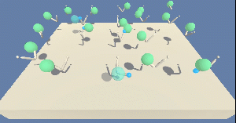

# Continuous Control using Proximal Policy Optimization 

### Introduction

For this project, we will work with the [Reacher](https://github.com/Unity-Technologies/ml-agents/blob/master/docs/Learning-Environment-Examples.md#reacher) environment.



In this environment, a double-jointed arm can move to target locations. A reward of +0.1 is provided for each step that the agent's hand is in the goal location. Thus, the goal of your agent is to maintain its position at the target location for as many time steps as possible.

The observation space consists of 33 variables corresponding to position, rotation, velocity, and angular velocities of the arm.

Each action is a vector with four numbers, corresponding to torque applicable to two joints. Every entry in the action vector is a number between -1 and 1.

### Project Details

This version of the Unity environment contains 20 identical agents.
The agents are trained using [PPO](https://arxiv.org/pdf/1707.06347.pdf) to get an average score of +30 (over 100 consecutive episodes, and over all agents).

  Specifically,
- After each episode, we add up the rewards that each agent received (without discounting), to get a score for each agent.  This yields 20 (potentially different) scores.  We then take the average of these 20 scores. 
- This yields an **average score** for each episode (where the average is over all 20 agents).

When the average of the average scores is at least +30, the environment is considered solved.

### Getting Started

1. Clone this repository, and navigate to the `PromixalPolicyOptimization/` folder.  Then, install several dependencies.

```bash
git clone https://github.com/primeMover2011/PromixalPolicyOptimization.git
cd PromixalPolicyOptimization
```


2. Download the environment from one of the links below.  You need only select the environment that matches your operating system:

    - Linux: [click here](https://s3-us-west-1.amazonaws.com/udacity-drlnd/P2/Reacher/Reacher_Linux.zip)
    - Mac OSX: [click here](https://s3-us-west-1.amazonaws.com/udacity-drlnd/P2/Reacher/Reacher.app.zip)
    - Windows (32-bit): [click here](https://s3-us-west-1.amazonaws.com/udacity-drlnd/P2/Reacher/Reacher_Windows_x86.zip)
    - Windows (64-bit): [click here](https://s3-us-west-1.amazonaws.com/udacity-drlnd/P2/Reacher/Reacher_Windows_x86_64.zip)

    (_For Windows users_) Check out [this link](https://support.microsoft.com/en-us/help/827218/how-to-determine-whether-a-computer-is-running-a-32-bit-version-or-64) if you need help with determining if your computer is running a 32-bit version or 64-bit version of the Windows operating system.

    (_For AWS_) If you'd like to train the agent on AWS (and have not [enabled a virtual screen](https://github.com/Unity-Technologies/ml-agents/blob/master/docs/Training-on-Amazon-Web-Service.md)), then please use [this link](https://s3-us-west-1.amazonaws.com/udacity-drlnd/P2/Reacher/one_agent/Reacher_Linux_NoVis.zip) (version 1) or [this link](https://s3-us-west-1.amazonaws.com/udacity-drlnd/P2/Reacher/Reacher_Linux_NoVis.zip) (version 2) to obtain the "headless" version of the environment.  You will **not** be able to watch the agent without enabling a virtual screen, but you will be able to train the agent.  (_To watch the agent, you should follow the instructions to [enable a virtual screen](https://github.com/Unity-Technologies/ml-agents/blob/master/docs/Training-on-Amazon-Web-Service.md), and then download the environment for the **Linux** operating system above._)


3. Extract the contents of the file to a folder of you choice, preferably as a subfolder of this repository.

4. Install [conda](https://conda.io/en/latest/miniconda.html) 

5. cd in to the directory where you cloned this repository, create a virtual environment and install the required python packages using these commands

```bash
cd PromixalPolicyOptimization
conda env create -f environment.yml
```

activate the environment using

```bash
conda activate PromixalPolicyOptimization
```

update the location of the environment in _main.py_ and in _test.py_

```python
    env = UnityEnvironment(file_name='YOUR_PATH_HERE', base_port=64739)
```

6. Watch the pretrained agent.

```python
  python test.py
```


7. Train your own agent using default parameters. 

```python
  python main.py
```

8. Read [the report] and play around with the code. Best starting point is defining your own experiments using some changes in hyper parameters.

_in main.py_ change
```python
    scores = [

    run_experiment(hidden_size=256, lr=1e-3, max_episodes=500, mini_batch_size=128,
                   nrmlz_adv=True, num_steps=2048, ppo_epochs=4, threshold_reward=30,
                   gamma=0.99, tau=0.95, clip_gradients=True)
    ]
```


# Enjoy!


