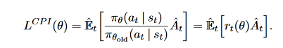
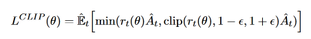
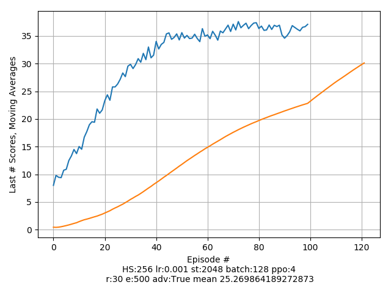

# Project report

## Learning algorithm

In this project, Proximal Policy Optimization (PPO) is used to train the agents. PPO was introduced by [OpenAI](https://openai.com/blog/openai-baselines-ppo/) 

From the website:

> Policy gradient methods are fundamental to recent breakthroughs in using deep neural networks for control, from video games, to 3D
> locomotion, to Go. But getting good results via policy gradient methods is challenging because they are sensitive to the choice of
> stepsize — too small, and progress is hopelessly slow; too large and the signal is overwhelmed by the noise, or one might see catastrophic
> drops in performance. They also often have very poor sample efficiency, taking millions (or billions) of timesteps to learn simple tasks.

PPO is a policy gradient method. Policy gradient methods work by computing 
an estimator of the policy gradient and plugging it into a stochastic gradient ascent algorithm.  

One novelty in OpenAIs approach with PPO was to introduce the clipped surrogate objective function in addition to 
the probability ratio between old and new policy, which acts as a surrogate objective that is optimized 
in [Trust Region Policy Optimization (TRPO)](https://arxiv.org/abs/1502.05477)



The main objective in PPO is thus



from agent.py

```python

    ratio = (new_log_probs - old_log_probs).exp()
    # surrogate objective: probability ratio between old and new policy
    surr1 = ratio * advantage
    # clipped surrogate objective
    surr2 = torch.clamp(ratio, 1.0 - clip_param, 1.0 + clip_param) * advantage
    loss = - torch.min(surr1, surr2).mean()
```

This clipping helps keeping the update to the policy in a small range. 

Another innovation in OpenAIs approach is running the optimizer a number of times over sampled minibatches of a policy.

More info on the details of the algorithm [can be found in the paper.](https://arxiv.org/abs/1707.06347)

In this implementation I am also using [Generalized Advantage Estimation](https://arxiv.org/abs/1506.02438) to train 
the critic network.

## Parameters and hyperparameters

### Neural network architecture

The network consists of two networks: The actor network and the critic network.

*The actor network* takes a state tensor as an input and outputs an action.

*The critic network* is not directly needed for the PPO algorithm (original paper describes policy network and surrogate function which counts ration of new action probabilites to old ones - actor would suffice) but it's very helpful to compute advantages which requires value for state.

#### Actor network

- 3 fully connected layers
- 33 input nodes: _size of state vector_
- 4 output nodes: _size of action vector_
- 256 hidden nodes in each layer
- ReLU activations, tanh on last layer

#### Critic network

- 3 fully connected layers
- 33 input nodes [observation vector size], 1 output nodes, 512 hidden nodes in each layer
- ReLU activations, no activation on last layer

### Algorithm hyperparameters

hyperparameters that can be tuned
from main.py

````python

    run_experiment(hidden_size=256, lr=1e-3, max_episodes=500, mini_batch_size=128,
                   nrmlz_adv=True, num_steps=2048, ppo_epochs=4, threshold_reward=30,
                   gamma=0.99, tau=0.95, clip_gradients=True)

````

- _hidden_size_: number of neurons for each layer of each network
- _gamma_: the discount rate  `0.99`
- _lr_: the learning rate of both networks `1e-3`
- _tau_: "discount factor" for GAE `0.95`
- _max_episodes_:  how long to train `500`
- _num_steps_:  Rollout length - `2048`
- _ppo_epochs_: how many epochs to run PPO - `4`
- _clip_gradients_: gradients will be clipped if set to True
- _nrmlz_adv_: when True normalizes advantages.
- _threshold_reward_: when the moving average of the last 100 episodes exceeds this value, the training is finished. 

## Results

It was extremely hard to get this agent to learn. I tried several different sets of hyperparamters 
which were of no help at all. Even adding GAE did not help learning. The key ingredient that made the agent learn is 
*advantage normalization*. Just in case, you'd like to find out, I added a special hyperparameter called _nrmlz_adv_.
If you set
```python
 nrmlz_adv = False
```
you can watch your agents going nowhere at all.

With the right set of hyperparameters, the results are as follows:

> Episode 0, Total score this episode: 0.4309999903663993, Last 0 average: 0.4309999903663993<br>
> ...<br>
> Episode 55, Total score this episode: 30.905999309197068, Last 55 average: 13.403428271838598<br>
> Episode 121, Total score this episode: 37.10649917060509, Last 100 average: 30.123479326687754

##### Environment solved in 121 episodes!	Average Score: 30.12

Scores of last 100 episodes and moving average of all episodes.


## Next steps
To improve the agents performance
- train longer
- try different network architectures, maybe an LSTM
- investigate different initialization schemes for the neural networks
- try some ideas from [PPO-CMA: Proximal Policy Optimization with Covariance Matrix Adaptation](https://arxiv.org/abs/1810.02541v5)
